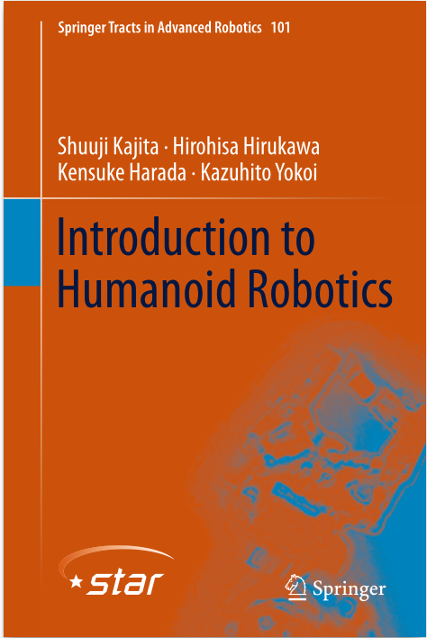
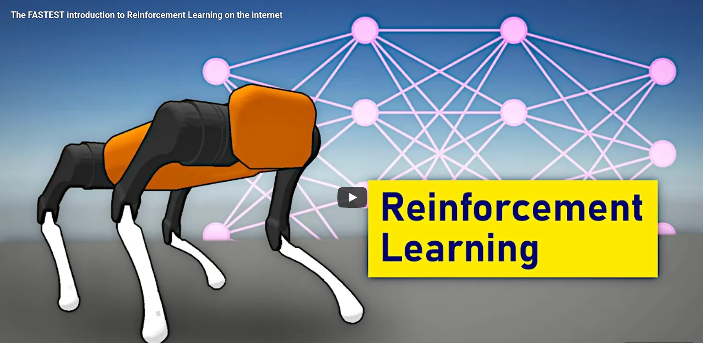

  <h1>📘 Review Buku</h1>
  
  <h3><u>Introduction to Humanoid Robotics</u></h3>

---

## BAB 1 – Introduction (Robot Humanoid)

### 🤖 Apa itu Robot Humanoid?
Robot dengan bentuk & gerak menyerupai manusia:
- 2 kaki, 2 tangan, badan, kepala

**Kenapa bentuk manusia?**
- Bekerja di lingkungan manusia
- Menggunakan alat manusia
- Interaksi sosial lebih alami

📌 Robot menyesuaikan diri dengan dunia manusia — bukan sebaliknya

---

## BAB 2 – Kinematics (Gerak Robot)

📐 Kinematika = ilmu gerak **tanpa mempedulikan gaya**

Digunakan untuk:
- Menghitung posisi tangan/kaki
- Menentukan sudut sendi
- Menghubungkan bagian tubuh

### Konsep Kunci:
- Coordinate Frame
- Homogeneous Transformation Matrix
- Forward & Inverse Kinematics
- Jacobian & Singularitas

---

## BAB 3 – ZMP & Dynamics (Keseimbangan)

⚠️ Tantangan utama humanoid: **tidak jatuh**

### Zero Moment Point (ZMP)
- Titik di lantai tempat momen = 0
- **ZMP harus berada di dalam Support Polygon**

Digunakan bersama:
- Center of Mass
- Force/Torque Sensor
- Dinamika tubuh

---

## BAB 4 – Biped Walking (Berjalan Dua Kaki)

Berjalan ≠ mengangkat kaki.

Robot harus:
- Memindahkan CoM
- Menjaga keseimbangan
- Menghindari slip

📌 Model utama:
- **Linear Inverted Pendulum Model (LIPM)**
- **ZMP-Based Walking**
- **Preview Control**

---

## BAB 5 – Whole Body Motion

Robot mampu:
- Berdiri dari jatuh
- Membawa barang
- Membuka pintu
- Jatuh dengan aman

Teknik penting:
- Motion Capture
- Auto Balancer
- Dynamics Filter

---

## BAB 6 – Dynamic Simulation

Semua diuji di simulasi sebelum ke robot nyata.

Metode utama:
- Forward & Inverse Dynamics
- Newton–Euler
- Featherstone Algorithm

📌 Digunakan di:
- ROS
- Gazebo
- MuJoCo

---

## 📚 Kosakata Penting (Cheat Sheet)

| No | Istilah | Arti Singkat | Inti |
|--|--|--|--|
| 1 | Joint | Sendi bergerak | Tempat gerak |
| 2 | Link | Bagian kaku | Tidak bergerak |
| 3 | DOF | Derajat kebebasan | Fleksibilitas |
| 4 | FK | Sudut → posisi | Mudah |
| 5 | IK | Posisi → sudut | Sulit |
| 6 | Jacobian | Kecepatan | Kontrol |
| 7 | ZMP | Stabilitas | Tidak jatuh |
| 8 | CoM | Pusat massa | Keseimbangan |
| 9 | LIPM | Model berjalan | Sederhana |
| 10 | Simulation | Uji virtual | Aman |

   

  <h1>🚀 Review Video</h1>
  
  <h3><u>The FASTEST Introduction to Reinforcement Learning on the Internet</u></h3>

---

## 🎯 Apa itu Reinforcement Learning (RL)?

**Reinforcement Learning (RL)** adalah paradigma *machine learning* di mana sebuah **agen** belajar melalui **trial and error** dengan berinteraksi langsung dengan lingkungannya.

Alih-alih diberi jawaban benar/salah, agen:
> melakukan aksi → menerima feedback → memperbaiki strategi

### 🔑 Komponen Utama RL
1. **State ($S$)** – Kondisi lingkungan saat ini (posisi robot, sensor, kecepatan, koordinat sendi, dll).
2. **Action ($A$)** – Tindakan yang dapat diambil agen (torsi motor, langkah kaki, rotasi servo).
3. **Reward ($R$)** – Nilai evaluasi (positif jika stabil/mencapai goal, negatif jika jatuh/tabrakan).
4. **Policy ($\pi$)** – Strategi atau "peta" untuk memilih action terbaik pada setiap state.

🎯 **Tujuan RL:** Memaksimalkan **total reward jangka panjang** (akumulasi imbalan hingga akhir tugas).

---

## 🔄 Bagaimana Reinforcement Learning Bekerja? (Detail Teknis)

Proses RL berjalan secara **iteratif** melalui mekanisme **Markov Decision Process (MDP)**:

1. **Observasi** – Agen mengamati **State** (berdasarkan hukum *Markov Property*: masa lalu tidak penting, hanya kondisi sekarang yang menentukan masa depan).
2. **Aksi** – Agen memilih **Action** berdasarkan **Policy** saat ini.
3. **Reward** – Lingkungan memberi feedback yang dikalikan dengan **Discount Factor ($\gamma$)** agar agen tidak menunda-nunda tujuan.
4. **Update Policy** – Strategi diperbarui menggunakan **Bellman Equation** untuk menghitung nilai masa depan.
5. **Repeat** – Dilakukan ribuan hingga jutaan kali hingga konvergen.

---

## 🎮 Contoh Sederhana (Analogi Game & Simulasi)

- Mulai dari level awal (**state**)
- Pilih langkah (**action**)
- Dapat skor / penalti (**reward**)
- Belajar strategi terbaik (**policy**)

➡️ Semakin sering bermain, semakin pintar strateginya melalui pembaruan **Q-Table** atau **Neural Network**.

---

## 🤖 Mengapa RL Penting untuk Robot Humanoid?

Robot humanoid **tidak mungkin diprogram secara manual untuk semua kondisi**, karena masalah yang dijelaskan dalam buku *Introduction to Humanoid Robotics*:

* **Lingkungan Dinamis:** Medan yang tidak rata atau licin sulit dihitung secara kaku.
* **Derajat Kebebasan (DoF) yang Tinggi:** Terlalu banyak sendi untuk dikontrol manual satu per satu.
* **Keseimbangan ZMP:** Menjaga *Zero Moment Point* (Bab 3) membutuhkan koreksi mikro instan.

🔑 **RL memungkinkan robot:**
- **Belajar dari pengalaman:** Menemukan pola jalan yang stabil secara mandiri.
- **Beradaptasi:** Menangani gangguan fisik (dorongan atau permukaan miring) secara *real-time*.
- **Optimasi Kinematika:** Menyelesaikan masalah *Inverse Kinematics* (Bab 2) melalui intuisi data, bukan sekadar rumus statis.

---

## 🧠 Algoritma Reinforcement Learning & Koneksi Biologis

| Metode | Penjelasan Singkat | Hubungan dengan Otak |
|------|-------------------|-------------------|
| **Value-Based** | Belajar nilai setiap aksi (Contoh: Q-Learning / DQN) | Memori tentang mana yang "berharga". |
| **Policy-Based** | Langsung belajar strategi tindakan terbaik | Insting motorik. |
| **Actor–Critic** | Gabungan value (Critic) & policy (Actor) | **Basal Ganglia** (Striatum sebagai Critic). |
| **Deep RL** | RL + Neural Network (untuk sensor kompleks) | Cara saraf manusia memproses visual/IMU. |

> **Fakta Penting:** RL meniru sistem **Dopamin** manusia sebagai *Reward Prediction Error* (RPE). Belajar terjadi ketika robot "terkejut" karena hasil nyata lebih baik dari prediksi awal.

---

## 🧾 Ringkasan Parameter RL

| Konsep | Makna | Aplikasi pada Humanoid |
|------|------|------|
| **RL** | Belajar dari trial-and-error | Optimasi pola jalan (Walking Pattern). |
| **Agent** | Robot / algoritma | Controller (Open-HRP / Matlab). |
| **State** | Kondisi lingkungan | Sensor IMU & Posisi ZMP. |
| **Action** | Tindakan agen | Torsi motor pada sendi bipedal. |
| **Reward** | Feedback | +1 jika melangkah, -100 jika jatuh. |
| **Policy** | Strategi | Algoritma penyeimbang (Stabilizer). |
| **Goal** | Maksimalkan reward | Navigasi tanpa jatuh. |

 

## 🚀 Tantangan: Sample Inefficiency
Karena robot butuh jutaan percobaan, pembuatan humanoid harus melibatkan:
1. **Simulasi Dinamis (Bab 6):** Latihan di dunia maya (Gazebo/MuJoCo) agar hardware tidak rusak.
2. **World Models:** Agen membangun imajinasi tentang hukum fisika sebelum mencoba aksi fisik.

## 🧠 Kesimpulan

📘 **Buku** → fondasi matematis & kontrol humanoid  
🎮 **RL** → kecerdasan & adaptasi perilaku  

➡️ **RL berdiri di atas kinematika, dinamika, dan ZMP**  

---
